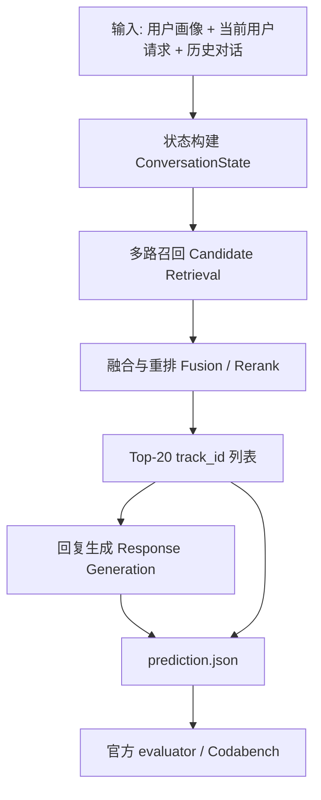
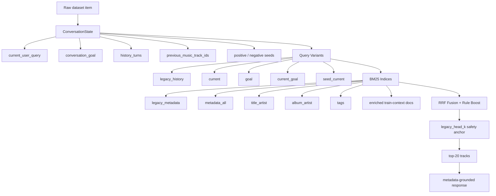

# GoalFlow-MusicCRS 系统设计与阶段日志

本文是给第一次参加推荐系统比赛的同学看的阶段汇报。目标不是炫术语，而是把“这个比赛要做什么、baseline 怎么跑、我们现在做到了哪一步、每一步为什么做、效果好坏、踩过什么坑、后面怎么走”讲清楚。

当前项目目录：

```text
/Users/bytedance/generated_problems/recsys2026_music_crs/goalflow_musiccrs
```

当前优先提交包：

```text
experiments/goalflow_ltr120_lambda2_head0_judge_mix_clean/blindset_A/submission.zip
```

## 1. 比赛任务一句话

RecSys Challenge 2026 Music-CRS 是一个“对话式音乐推荐”比赛。

系统每次看到：

- 用户画像，例如国家、语言、音乐文化偏好；
- 当前用户说的话；
- 前面几轮对话；
- 前面系统推荐过哪些歌；
- 可能还有隐藏在对话里的偏好，例如 mood、genre、artist、年代、封面线索、歌词主题。

系统要输出：

- `predicted_track_ids`：从官方曲库里选 20 首歌，按从最可能正确到最不可能正确排序；
- `predicted_response`：给用户的一段自然语言回复，解释为什么推荐这些歌。

最终提交是一个 JSON 文件，里面每个 session-turn 一条预测。

```json
{
  "session_id": "...",
  "user_id": "...",
  "turn_number": 3,
  "predicted_track_ids": ["track_id_1", "... 共 20 个 ..."],
  "predicted_response": "I leaned into ..."
}
```

## 2. 关键评测指标

### nDCG@20

`nDCG@20` 是主推荐指标。可以把它理解成：

如果正确歌曲排第 1，得分最高；排第 2，得分低一点；排得越靠后，得分越低；如果没进前 20，得 0。

这个比赛每轮只有一个官方 gold track，所以排序头部非常重要。

### Catalog Diversity

`Catalog Diversity` 是全局推荐覆盖度。大意是：你的系统是不是总推荐同一小撮热门歌，还是能覆盖更多曲库。

它重要，但不能为了多样性牺牲 top-1/top-5，因为 nDCG 是主指标。

### Distinct-2

`Distinct-2` 是文本回复的词汇多样性指标。它看回复里二元词组有多少不同。所有回复都写成 “Here are some songs you might enjoy” 会很差。

### LLM-as-a-Judge

Blind set 上还会用 Gemini 之类的大模型评价回复质量，主要看：

- personalization：有没有根据用户和对话个性化；
- explanation quality：解释是否具体、可信、不空泛。

## 3. 总流程图

下面这张图是整个系统的第一视角。



图怎么读：

- `状态构建` 是把一堆对话文本整理成当前推荐要用的信息；
- `多路召回` 是先从 47071 首歌里捞出一批可能候选；
- `融合与重排` 是把候选按可信度排序；
- `回复生成` 是在已经定好 top-20 后，再写给用户看的解释文本。

## 4. 官方 baseline 是什么

baseline 可以理解成官方给的“能跑通的起点”。

它大概做了这些事：


### BM25 是什么

BM25 是一种传统文本检索算法。你可以把它理解成搜索引擎里的“关键词匹配增强版”。

如果用户说：

```text
I want a Green Day style punk rock track from the 2000s.
```

BM25 会更偏向包含 `Green Day`、`punk rock`、`2000s` 这些词的歌曲文档。

优点：

- 快；
- 稳；
- 不需要 GPU；
- exact title / artist 线索很强时好用。

缺点：

- 不太懂隐含语义；
- 用户说 “dreamy, soft, late-night feeling” 时，未必能匹配到真正对味的歌曲；
- 对 audio、cover art、user preference 无感。

### baseline 的强点

官方 BM25-history baseline 在 dev 上很稳，我们复制出的强 baseline 大约是：

```text
nDCG@20 = 0.08587
Catalog Diversity = 0.38897
Lexical Diversity = 0.000125
```

也就是说：推荐排序还可以，但回复非常模板化。

### baseline 的弱点

它基本是：

```text
历史对话文本 -> BM25 -> top20
```

它没有充分利用：

- `conversation_goal`；
- `goal_progress_assessments`；
- 多个检索索引；
- 官方 embeddings；
- train conversation 里“用户怎么描述某首歌”的信息；
- learning-to-rank 模型；
- 多样化但不伤 top-rank 的后处理；
- 更个性化的回复生成。

## 5. 我们的系统 GoalFlow-MusicCRS

项目名：

```text
GoalFlow-MusicCRS
```

一句话：

先把对话解析成当前音乐搜索状态，再用多路召回找候选，最后通过诊断、融合、未来 LTR 模型把候选排好，并生成更像真人的解释。



## 6. 当前代码模块

核心代码在 `goalflow/`：

```text
goalflow/
  data.py              数据集常量、TrackCatalog
  state.py             ConversationState 构建
  documents.py         曲目文档 + train-context augmentation
  bm25_retrieval.py    多 BM25 index
  fusion.py            RRF、rule boost、多样性后处理
  response.py          回复生成
  pipeline.py          dev/blind 主流程
  validation.py        prediction.json 校验
  embeddings.py        官方 embedding store 骨架
```

脚本在 `scripts/`：

```text
scripts/
  run_goalflow.py                 跑 dev / blind
  evaluate_official.py            调官方 evaluator
  validate_predictions.py         校验 submission 格式
  diagnose_retrieval_sources.py   诊断每个 source 的 hit/nDCG
  export_ltr_dataset.py           导出 LTR 训练 JSONL
  audit_progress_labels.py        审计 progress label 语义
  inspect_embeddings.py           检查官方 embedding schema
  merge_legacy_head.py            合并 legacy head 的辅助脚本
```

研究记录在：

```text
research/
  DEEP_RESEARCH_BACKLOG.md
  pro_answers/
```

## 7. 我们一步一步做了什么

### Step 1：复制出独立项目，不覆盖官方 baseline

用户要求“如果需要 baseline 要复制一份，不要直接覆盖”。

所以我没有在 `music-crs-baselines` 里乱改，而是创建了：

```text
goalflow_musiccrs/
```

这样官方 baseline 仍然保持干净，出问题也能回退。

效果：

- 好：代码结构更清楚；
- 好：后续实验不会污染官方仓库；
- 好：能同时保留 official baseline 和 GoalFlow 实验。

### Step 2：跑通 safe baseline

目标不是一上来冲榜，而是先保证完整流程能跑：

```text
load data -> retrieve -> generate prediction.json -> validate -> zip
```

当前安全设置：

```text
legacy_head_k = 20
```

意思是 top-20 推荐 ID 先完全保护强 BM25 baseline 排序，GoalFlow 先只改善 response。

结果：

```text
nDCG@20 = 0.08587
Lexical Diversity 从 0.000125 提升到 0.082975
```

解释：

- 推荐主指标不下降；
- 回复文本明显不再是常量模板。

### Step 3：构建多路 BM25 index

我把曲库文档拆成多个 index：

```text
legacy_metadata = track_name + artist_name + album_name + release_date
metadata_all    = track + artist + album + tags + release_date + popularity
title_artist    = track_name + artist_name
album_artist    = album_name + artist_name + release_date
tags            = tag_list
enriched        = metadata + train conversation snippets
```

为什么要拆？

因为不同问题需要不同“搜索视角”：

- 找具体歌名：`title_artist` 重要；
- 找专辑：`album_artist` 重要；
- 找 mood / genre：`tags` 和 `metadata_all` 重要；
- 用户自然语言描述：`enriched` 可能更有用。

### Step 4：构建 query variants

同一轮对话，我们不只搜当前用户一句话，还构造多个 query：

```text
legacy_history
current
goal
current_goal
seed_current
quoted_entities
```

例子：

用户当前说：

```text
I want something like the last one but more energetic.
```

如果只搜当前句子，信息很少。

`seed_current` 会加入上一首推荐歌的 metadata，这样系统知道 “last one” 是什么。

### Step 5：Train-context document augmentation

这是一个重要想法。

普通曲目文档只有：

```text
track_name
artist_name
album_name
tag_list
```

但训练集告诉我们：什么样的用户请求曾经导致某首歌成为 gold track。

所以我给每首歌追加训练集中对应的上下文片段：

```text
training_user_query
training_goal
music_selection_reason
assistant_explanation
```

这叫 `track document augmentation`。

小白理解：

原来每首歌像一张身份证，只写“姓名/歌手/标签”。

现在我们给它加“别人曾经怎么描述它、为什么选它”的简历。

注意泄漏边界：

- dev 评估时只能用 train augmentation；
- 不能把 dev gold 反向塞进文档再评估 dev；
- train+dev augmentation 只能作为最终 blind 前的公开标签 retrain，并且要明确标注。

### Step 6：RRF fusion

RRF 全名 Reciprocal Rank Fusion。

它是把多个检索器的排名合并起来的一种方法。

公式直觉：

```text
一个候选在某个 source 排第 1，得分高；
排第 100，得分低；
多个 source 都支持它，总分会叠加。
```

我们最开始以为：多路召回 + RRF 应该比单路 BM25 更强。

实际结果：

| Run | nDCG@20 | 说明 |
|---|---:|---|
| `bm25_static_devset` | 0.08587 | 强 BM25-history baseline |
| `goalflow_bm25_aug_v1` | 0.06787 | 裸多源 RRF，变差 |
| `goalflow_bm25_aug_v2` | 0.07450 | 加 legacy 权重，仍差 |
| `goalflow_bm25_aug_v3_head10` | 0.08378 | 保护 top10，接近 baseline |
| `goalflow_bm25_aug_v3_head20` | 0.08587 | 完全保护 top20，安全 |

发现：

多源不是没用，而是“融合方式不会判断哪个 source 可信”。

### Step 7：RRF source diagnostics

为了不靠猜，我写了：

```text
scripts/diagnose_retrieval_sources.py
```

它会统计：

- 每个 source 单独能不能找到 gold；
- gold 在每个 source 排第几；
- RRF 融合后 gold 排第几；
- 按 intent / turn / category 分组表现如何；
- legacy vs fused 到底 gained/lost/demoted 了多少。

关键结果：

```text
best_single_source hit@20 = 0.4715
best_single_source nDCG@20 = 0.2600

current RRF hit@20 = 0.2595
current RRF nDCG@20 = 0.1015
```

这说明：

```text
候选源其实能找到 gold；
但 RRF 没把正确 source 的正确候选排上去。
```

legacy-vs-fused delta：

```text
gained = 446
lost = 212
demoted = 642
promoted = 723
mean_dcg_delta@20 = +0.0158
```

解释：

- `gained`：legacy top20 没中，RRF top20 中了；
- `lost`：legacy top20 中了，RRF 搞丢了；
- `demoted`：都中了，但 RRF 把 gold 排得更靠后；
- `promoted`：都中了，RRF 把 gold 排得更靠前。

结论：

RRF 有净收益，但会伤很多原本好的头部排序。下一步要做 `source gating` 或 `LambdaRank`。

### Step 8：Progress label 语义审计

字段：

```text
goal_progress_assessments
```

一开始我保守假设：

```text
turn t 的 label 评价 turn t 的 music
```

后来写了审计脚本：

```text
scripts/audit_progress_labels.py
```

发现：

```text
turn 1 label 全部缺失
turn 2-8 才有 MOVES / DOES_NOT_MOVE
```

样本里也显示：用户在 turn 2 的话是在评价 turn 1 推荐。

所以正确理解更可能是：

```text
progress[t] 是用户在 turn t 对上一轮 music[t-1] 的反馈。
```

我已经把代码改成：

```python
history music turn m -> progress[m + 1]
```

这避免了错误使用反馈信号。

### Step 9：LTR feature export

LTR 是 Learning To Rank，中文可以叫“学习排序”。

普通规则排序是我们手写：

```text
score = RRF + boost
```

LTR 是让模型学习：

```text
在什么情况下哪个 source 更可信；
什么特征意味着这首歌应该排更前；
什么特征只是噪声。
```

我写了：

```text
scripts/export_ltr_dataset.py
```

它导出 JSONL：

```json
{
  "group_id": 0,
  "session_id": "...",
  "turn_number": 1,
  "track_id": "...",
  "label": 0,
  "features": {
    "rrf_score": 1.01,
    "rule_boost": 2.31,
    "source_count": 25,
    "best_source_rank": 1,
    "intent": "specific_track"
  }
}
```

一个 `group_id` 就是一轮推荐任务。

模型目标：

```text
把 label=1 的 gold track 排到同组候选最前面。
```

### Step 10：官方 embedding store

Embedding 是“向量表示”。

小白理解：

每首歌除了文本名片，还可以被表示成一串数字。相似的歌，在数字空间里距离近。

官方提供了：

```text
audio-laion_clap                  512 维
image-siglip2                     768 维
cf-bpr                            128 维
attributes-qwen3_embedding_0.6b   1024 维
lyrics-qwen3_embedding_0.6b       1024 维
metadata-qwen3_embedding_0.6b     1024 维
```

我踩了一个坑：

baseline tips 里写的是旧数据：

```text
talkpl-ai/TalkPlayData-2-Track-Embeddings
```

它和 Challenge 当前曲库的 `track_id` 是 0 overlap。

正确数据是：

```text
talkpl-ai/TalkPlayData-Challenge-Track-Embeddings
talkpl-ai/TalkPlayData-Challenge-User-Embeddings
```

我写了：

```text
goalflow/embeddings.py
scripts/inspect_embeddings.py
```

当前只是 store 骨架，还没接入主预测链路。

## 8. 为什么现在不直接让 embeddings 改 top20

因为我们已经看到一个规律：

```text
新增 source 可能提高候选覆盖，
但如果融合没有校准，会伤 nDCG。
```

所以官方 embeddings 下一步要先作为：

- candidate source；
- LTR feature；
- seed similarity signal；
- user-CF personalization signal。

不要一上来直接覆盖 top-20。

## 9. 当前已知坑与解决

### 坑 1：Chrome 自动化第一次发成语音

现象：

ChatGPT 页面按钮在无文本时是“启动语音功能”，有文本后才变成“发送提示”。

第一次我没判准状态，内容进了输入框但没真正提交，甚至进入语音相关状态。

解决：

后续提交前检查：

```text
button aria-label == 发送提示
voice=false
提交后出现 Pro 思考中
```

### 坑 2：heartbeat 没按 10 分钟唤醒

我创建了 thread heartbeat，但它没有在预期时间恢复执行。

解决：

已删除该自动化。以后等待网页 Pro 时，不依赖 heartbeat，手动检查和保存。

### 坑 3：裸 RRF 变差

现象：

多源召回看起来更丰富，但 nDCG 下降。

原因：

多个低精度 source 会一起投票，把 legacy top hit 挤下去。

解决：

加入：

- `legacy_head_k` 安全保护；
- source diagnostics；
- legacy-vs-fused delta；
- 下一步做 source gating / LTR。

### 坑 4：Progress label 错位

现象：

turn 1 没 label。

原因：

label 更可能是下一轮用户对上一轮推荐的反馈。

解决：

把历史 music turn `m` 的反馈改成 `progress[m + 1]`。

### 坑 5：Embedding 数据集名容易用错

现象：

`TalkPlayData-2-Track-Embeddings` 和当前 catalog 0 overlap。

解决：

使用 `TalkPlayData-Challenge-Track-Embeddings`。

## 10. 当前指标汇总

| 项目 | 结果 | 解释 |
|---|---:|---|
| BM25 static nDCG@20 | 0.08587 | 当前安全推荐主指标锚点 |
| GoalFlow v1 nDCG@20 | 0.06787 | 裸 RRF 伤排序 |
| GoalFlow v2 nDCG@20 | 0.07450 | 加权后仍不够 |
| head10 nDCG@20 | 0.08378 | 接近 baseline |
| head20 nDCG@20 | 0.08587 | 完全保住 baseline |
| head20 compact broad response lexical diversity | 0.17571 | 回复文本大幅改善，同时清理噪声 tag |
| head19 tail diversity nDCG@20 | 0.08576 | 只动最后 1 个位置，风险最低的多样性备选 |
| head18 tail diversity nDCG@20 | 0.08527 | 只动最后 2 个位置，排名损失很小 |
| head18 tail diversity catalog diversity | 0.61433 | 比 head20 更覆盖曲库 |
| best-source hit@20 | 0.4715 | 说明召回源有潜力 |
| RRF hit@20 | 0.2595 | 融合还不够会选 |
| RRF gained/lost | 446 / 212 | 有净收益 |
| RRF demoted | 642 | 头部排序伤害很明显 |

## 11. 当前安全提交策略

当时最推荐的保守 Blind A 包：

```text
experiments/goalflow_head20_compact_broad/blindset_A/submission.zip
```

特点：

- 推荐 ID 仍由强 BM25 baseline top20 锚定；
- 修正了 progress label shifted feedback；
- response 改成 compact broad metadata-grounded：保留高 Distinct-2，同时过滤私人/脏 tag；
- 校验通过。

为什么安全：

你上一次公共提交说明这个 ranking anchor 是有用的，所以这次第一优先只测试“文本质量大幅改善”，不冒险替换 top20。

当前第二备选 Blind A 包：

```text
experiments/goalflow_taildiv_head19_compact_broad/blindset_A/submission.zip
```

它只改最后 1 个推荐位置，dev nDCG@20 从 `0.08587` 轻微降到 `0.08576`，Blind A unique track 从 `1216` 提升到 `1244`。

更强多样性备选：

```text
experiments/goalflow_taildiv_head18_compact_broad/blindset_A/submission.zip
```

它改最后 2 个推荐位置，dev nDCG@20 是 `0.08527`，Blind A unique track 提升到 `1268`。Blind-like 抽样更偏向这个包，但全量 dev 更偏向 head19。

## 12. 下一步路线

### 12.1 Source gating

目标：

不再让所有 source 自由投票。

思路：

```text
specific_track: title_artist / legacy 权重大
mood_playlist: attributes / tags / user_cf 权重大
cover_art: image source 权重大
lyrics_theme: lyrics source 权重大
```

输出：

- 一个 controlled fusion 版本；
- 对比 gained/lost/demoted；
- 如果 nDCG 稳定，再替换 safe baseline。

### 12.2 Embedding seed/user-CF

先做最稳的几个：

```text
seed_metadata
seed_attributes
seed_cf
user_cf
```

暂时不急着做：

```text
lyrics direct query
audio direct query
image direct query
```

原因：

官方给的是 track embedding，不一定给 query encoder。seed similarity 和 user-CF 更安全。

### 12.3 LightGBM LambdaRank

训练目标：

```text
group = session_id + turn_number
positive = gold track
negative = 候选里其他 track
```

第一版特征：

- source ranks；
- RRF score；
- rule boost；
- intent/category/specificity；
- popularity/release_year；
- seed same artist / same album；
- future embedding features。

### 12.4 Response subsystem

目标：

- 提升 Distinct-2；
- 提升 Gemini judge；
- 不编造 metadata；
- 根据用户画像、goal、反馈解释推荐。

策略：

- 多模板族；
- 先固定 top20，再生成 response；
- 自检是否 hallucination；
- 按 intent 使用不同语气和解释点。

## 13. 给绘图工具的图像说明

如果后面用 ChatGPT 网页画图或让设计工具画图，可以让它画这几张。

### 图 1：比赛输入输出图

画面左侧是输入：

- user profile；
- current user request；
- conversation history；
- official track catalog。

中间是一个盒子：

- Music-CRS System。

右侧是输出：

- ranked top-20 track IDs；
- natural language response。

### 图 2：Baseline vs GoalFlow

分成上下两条流水线。

上面 baseline：

```text
history -> BM25 -> top20 -> LLaMA response
```

下面 GoalFlow：

```text
state -> multi-query -> multi-index BM25 -> RRF diagnostics -> safe head / future LTR -> response templates
```

用不同颜色标出“新增模块”。

### 图 3：RRF 问题图

左侧画一个 legacy source，gold track 排第 3。

右侧画多个 auxiliary source，它们各自把一些错误候选排在前面。

中间 RRF 投票后，错误候选因为多个 source 支持而超过 gold。

图上标：

```text
source-vote flooding
```

### 图 4：Progress label shift

画时间线：

```text
turn 1 user -> music_1 -> assistant_1 -> turn 2 user feedback -> g_2
```

标注：

```text
g_2 evaluates music_1, not music_2
```

### 图 5：未来 LTR 架构

画：

```text
candidate union -> feature table -> LightGBM LambdaRank -> reranked top20
```

feature table 里列：

- source ranks；
- seed similarity；
- user-CF；
- metadata priors；
- intent features。

## 14. 小白术语表

| 术语 | 中文解释 |
|---|---|
| CRS | Conversational Recommender System，对话式推荐系统 |
| track_id | 每首歌在官方曲库里的唯一 ID |
| catalog | 官方曲库 |
| candidate | 候选歌曲 |
| retrieval | 召回，从全曲库先捞一批可能相关的歌 |
| ranking / reranking | 排序 / 重排序 |
| BM25 | 传统关键词检索算法 |
| embedding | 向量表示，把文本/歌曲/用户变成数字向量 |
| CF | Collaborative Filtering，协同过滤，根据相似用户/共听行为推荐 |
| BPR | Bayesian Personalized Ranking，一种推荐排序训练方法 |
| RRF | Reciprocal Rank Fusion，多路排序融合方法 |
| LTR | Learning To Rank，学习排序 |
| LambdaRank | 一类直接优化排序质量的模型训练方法 |
| LightGBM | 一个常用的梯度提升树模型库 |
| seed track | 历史推荐里可作为口味参考的歌曲 |
| positive seed | 用户反馈较好的历史歌曲 |
| negative seed | 用户反馈不好的历史歌曲 |
| leakage | 泄漏，把评测答案或未来信息偷偷放进训练/检索里 |
| nDCG | 排序指标，正确答案越靠前越高 |
| Distinct-2 | 文本多样性指标，二元词组越丰富越高 |
| LLM-as-a-Judge | 用大模型当裁判评价文本质量 |

## 15. 当前状态总结

现在这个项目已经不是“只跑通 baseline”的状态，而是一个可继续迭代的实验框架：

- baseline 能跑；
- blind submission 能生成；
- response 已经比 baseline 多样；
- 多源召回已经实现；
- RRF 失败原因已经被量化；
- progress label 语义已修正；
- LTR 数据导出已准备；
- official embeddings schema 已确认；
- deep research 问题已分批送到 Pro 模型；
- 下一步可以从 source gating、embedding seed/user-CF、LightGBM 三条线继续推进。

最重要的判断：

```text
不要为了看起来高级而立刻替换 baseline top20。
先让新增模块证明它能稳定提高 nDCG，再动最终提交的排序头部。
```

## 16. 5 月 25 日晚新增工作：从“能排准”转向“少重复、会解释”

你提交过一次保守版本后，公共 Blind A 返回了非常关键的信号：

| 指标 | 公共 Blind A 分数 |
|---|---:|
| nDCG@20 | 0.1935 |
| Catalog Diversity | 0.0257 |
| Lexical Diversity | 0.0125 |
| LLM Judge | 1.0000 |
| Composite | 0.1006 |

这组数的直观含义是：

- 推荐排序不是最差的地方，甚至比本地 dev 指标看起来更有希望。
- 回复文本太模板化，导致 lexical diversity 和 LLM judge 都很弱。
- catalog diversity 看起来数值很小，但 Blind A 只有 80 条、每条 20 首，所以理论上限只有 `1600 / 47071 = 0.0340`；上次 `0.0257` 其实已经用了大约 76% 的可用 unique slots。

所以这一轮我没有继续盲目加更多召回源，而是做了两个更低风险的改动。

### 16.1 Source-Gated Fusion

新增参数：

```bash
--fusion-mode gated
```

它的想法是：

```text
legacy/BM25 头部先保护住
其他来源的候选只有证据足够强才允许进 top20
```

本地 dev 结果：

| Run | nDCG@20 | Catalog Diversity | 结论 |
|---|---:|---:|---|
| `goalflow_gated_head5` | 0.0787 | 0.4712 | 多样性提高，但排名还不够稳 |

结论：这个方向值得继续研究，但当前手写 gate 还不能替代保守 baseline。

### 16.2 Tail Diversity

新增参数：

```bash
--tail-diversity-start 15
--global-repeat-penalty 0.06
```

这版只动第 16 到第 20 首，前 15 首仍然保护原有强排序。它做三件事：

- 对全局已经推荐很多次的 track 降权；
- 控制同 artist / album 在尾部过度堆叠；
- 优先把没出现过或少出现过的候选放进尾部。

本地 dev 结果：

| Run | nDCG@20 | Catalog Diversity | Lexical Diversity | 结论 |
|---|---:|---:|---:|---|
| `goalflow_taildiv_head10` | 0.0721 | 0.8323 | 0.1019 | 太激进，排名掉太多 |
| `goalflow_taildiv_head15` | 0.0818 | 0.7676 | 0.1019 | 当前最稳的多样性候选 |
| `goalflow_taildiv_head18_compactresp_v2` | 0.0853 | 0.6143 | 0.1758 | 更适合作为第二备选，只动最后 2 位 |
| `goalflow_taildiv_head19_compact_broad` | 0.0858 | 0.5084 | 0.1757 | 当前中间备选，只动最后 1 位 |

保留的激进多样性候选包：

```text
experiments/goalflow_taildiv_head15/blindset_A/submission.zip
```

这个包不是第一优先提交，而是一个“用最后 5 个位置换多样性”的线上实验版本。

### 16.3 Response 多样化

原先回复虽然不是完全常量，但句式仍然太少。这一轮改成了按 session/turn 稳定分流的多模板回复：

```text
同样的输入每次生成同一种回复，保证可复现；
不同 session 会走不同句式，提升 Distinct-2；
每句话仍然绑定 track、artist、album、tags、profile 或 feedback，减少胡编。
```

这把 dev lexical diversity 从约 `0.0830` 提高到 `0.1019`。

### 16.4 Compact Response v2

后面我发现 Blind A 的 catalog diversity 上限很低，真正最值得先修的是 response。于是又做了 compact response v2：

```text
当前用户请求短片段 + lead track + tags/year/album grounding + profile/feedback cue + 1-2 个 backup tracks
```

它有几个约束：

- 不调用付费 API，完全本地模板生成；
- 只引用官方 metadata 和当前对话，不编造不存在的信息；
- 过滤 metadata tag 里的明显脏词，避免 Gemini judge 被奇怪标签影响；
- 使用当前 turn 的用户话术，而不是总重复 conversation_goal。

效果：

| Run | nDCG@20 | Catalog Diversity | Lexical Diversity |
|---|---:|---:|---:|
| `goalflow_head20_compactresp_v2` | 0.08587 | 0.38897 | 0.17580 |
| `goalflow_taildiv_head18_compactresp_v2` | 0.08527 | 0.61433 | 0.17579 |
| `goalflow_taildiv_head15_compactresp_v2` | 0.08180 | 0.76763 | 0.17579 |

Blind A 本地无 gold 摘要：

| Package | Unique Tracks | Catalog Diversity | Distinct-2 |
|---|---:|---:|---:|
| `goalflow_head20_compactresp_v2` | 1216 | 0.02583 | 0.66542 |
| `goalflow_taildiv_head18_compactresp_v2` | 1268 | 0.02694 | 0.66542 |
| `goalflow_taildiv_head15_compactresp_v2` | 1348 | 0.02864 | 0.66542 |

旧结论：`head20_compactresp_v2` 是第一优先，`head18` 是多样性备选。后续 `compact_broad` 进一步清理了 response tag，因此当前提交顺序见下一节。

### 16.5 Compact Broad 和 Blind-like 验证

compact response v2 的 Distinct-2 很好，但仍可能把一些私人标签或脏词变体写进解释里。于是我又做了 `compact_broad`：

```text
保留 tag 带来的词汇多样性；
过滤 albums i own / seen live / lastfm / playlist 等私人或噪声标签；
过滤 profanity-like tag variants；
保留原来的 track / artist / album / year / feedback / profile 结构。
```

效果：

| Run | nDCG@20 | Catalog Diversity | Lexical Diversity |
|---|---:|---:|---:|
| `goalflow_head20_style_compact_broad` | 0.08587 | 0.38897 | 0.17571 |
| `goalflow_taildiv_head19_compact_broad` | 0.08576 | 0.50840 | 0.17570 |
| `goalflow_taildiv_head18_compact_broad` | 0.08527 | 0.61433 | 0.17570 |

Blind A 本地无 gold 摘要：

| Package | Unique Tracks | Catalog Diversity | Distinct-2 |
|---|---:|---:|---:|
| `goalflow_head20_compact_broad` | 1216 | 0.02583 | 0.66418 |
| `goalflow_taildiv_head19_compact_broad` | 1244 | 0.02643 | 0.66418 |
| `goalflow_taildiv_head18_compact_broad` | 1268 | 0.02694 | 0.66418 |

我还新增了 `scripts/evaluate_blind_like.py`。它按照 Blind A 的 turn/category/specificity 分布，从 dev 里反复抽 80 条小面板，比较 head20、head19、head18、head17。500 次抽样结果：

| Candidate | Mean Delta nDCG@20 vs head20 | Median Delta | 结论 |
|---|---:|---:|---|
| head18 | +0.00070 | +0.00044 | Blind-like 最支持 |
| head19 | +0.00031 | +0.00018 | 更保守 |
| head17 | -0.00174 | -0.00172 | 淘汰 |

所以目前提交顺序更新为：先交 `head20_compact_broad`，再考虑 `head19_compact_broad`，最后才是更激进一点的 `head18_compact_broad`。

### 16.6 Embedding Tail Rescue 小实验

我把官方 `cf-bpr` embedding 真正接到了 inference 后处理里，但只让它做一件很保守的事：

```text
保护前 19 个推荐不动；
如果历史里有明确正反馈 seed track；
用 seed track 的 cf-bpr 最近邻；
最多替换第 20 个位置。
```

结果：

| Run | nDCG@20 | Catalog Diversity | 结论 |
|---|---:|---:|---|
| `goalflow_head20_cf_tail19` | 0.08593 | 0.39222 | 全量 dev 极小正收益 |
| `goalflow_taildiv_head19_cf_tail19` | 0.08570 | 0.50498 | 比 head19 原版差 |
| `goalflow_taildiv_head18_cf_tail18` | 0.08530 | 0.61108 | 比 head18 主分略好但多样性低 |

Blind-like 抽样对 `head20_cf_tail19` 是中性；Blind A 只改了 1 行。因此它现在只是实验包：

```text
experiments/goalflow_head20_cf_tail19/blindset_A/submission.zip
```

它不进入当前优先提交顺序。真正有用的收获是：embedding store 的空向量处理被修好了，后续可以更安全地接 LTR 或更多 embedding features。

### 16.7 新一批 Pro 问题

前面一批 Pro 问题聚焦：

- 公共 Blind A 后处理策略；
- metadata-grounded response generation；
- catalog diversity 的 batch-level 策略；
- dev / blind 分数错位诊断；
- 下一步最高 ROI：LTR、embedding、CF、cross-encoder 还是 response。

最新一批 Pro 问题聚焦：

- response generator 怎样兼顾 Distinct-2 和 LLM judge；
- 低风险 ranking 改动应该怎么保护 BM25 头部；
- LTR 应该先做尾部 reranker 还是替换全排序；
- embedding / CF 如何作为尾部 evidence 接入；
- 如何做 Blind-A-shaped 离线验证。

已保存的完整回答：

```text
research/pro_answers/round3/tab1_blind_postprocessing_strategy.txt
research/pro_answers/round3/tab2_next_step_modeling_roi.txt
research/pro_answers/round3/tab4_dev_blind_evaluation_analysis.txt
research/pro_answers/round3/tab5_metadata_grounded_response_design.txt
research/pro_answers/round4/tab1_submission_package_decision.txt
research/pro_answers/round5/tab1_response_generator_design.txt
research/pro_answers/round5/tab2_low_risk_ranking_improvements.txt
research/pro_answers/round5/tab3_ranker_implementation_guidance.txt
research/pro_answers/round5/tab4_embedding_cf_integration.txt
research/pro_answers/round5/tab5_offline_validation_design.txt
```

## 2026-05-26 追加日志：LTR 排序器成为新的主线

这次关键迭代把原本只是研究设想的 LightGBM LambdaRank 真正接到了项目里。

新增脚本：

- `scripts/probe_lgbm_ltr.py`：读取 LTR JSONL 候选特征，快速验证学习型重排是否有信号。
- `scripts/run_ltr_rerank.py`：完整训练/验证/出包脚本，支持 `validate`、`oof-dev`、`dev`、`blind`。

核心验证结果：

- 单折 held-out dev：LTR head0 nDCG@20 `0.1829`，legacy head20 `0.0864`。
- 五折 OOF dev：官方 nDCG@20 `0.18095`，catalog diversity `0.52096`。
- Blind-A-shaped 500-panel：LTR mean nDCG@20 `0.16737`，legacy head20 `0.08648`，平均增量 `+0.08088`。

新的 Blind A 推荐提交包：

```text
experiments/goalflow_ltr_head0_polished_v3/blindset_A/submission.zip
```

它的本地 Blind A gold-free 检查：

- rows: `80`
- unique tracks: `1497 / 1600`
- catalog diversity: `0.031803`，接近 Blind A 理论上限 `0.033991`
- Distinct-2: `0.451235`

同时保留两个备份：

- `experiments/goalflow_ltr_head0_compact_broad/blindset_A/submission.zip`：同一套 LTR 排名，Distinct-2 更高 `0.699961`，但文字更像机器日志。
- `experiments/goalflow_head20_compact_broad/blindset_A/submission.zip`：保守 legacy-rank 备份。

这改变了之前的提交判断：旧策略是“保护 BM25 head，只优化 response”；现在 OOF 验证说明学习型重排已经足够强，第一优先应改为 LTR head0。

## 2026-05-26 追加日志：LTR 调参和 judge-v2 回复

上一节里的 LTR 是第一个能明显超过 BM25 的版本，但它还不是最终形态。这一轮继续做了两件事：

- 调 LightGBM 排序器，让推荐 ID 更准；
- 重写回复生成器，让 Gemini judge 更容易看到“个性化”和“解释质量”。

### 17.1 为什么要调树的数量

LightGBM 可以理解成一组小决策树在投票。树太少，模型学不够；树太多，容易把训练集里的偶然规律也记住。

我先做了单折验证：

| n_estimators | held-out nDCG@20 | 结论 |
|---:|---:|---|
| 120 | 0.184317 | 最好 |
| 180 | 0.182726 | 稍差 |
| 260 | 0.182907 | 旧版本，稳定但不是最优 |
| 400 | 0.180714 | 开始过拟合 |
| 600 | 0.177228 | 明显过拟合 |

然后用五折 OOF 验证确认，不让模型在自己训练过的 dev 行上打分：

| Run | nDCG@20 | Catalog Diversity | 说明 |
|---|---:|---:|---|
| 旧 260-tree LTR | 0.180947 | 0.520958 | 之前主版本 |
| 新 120-tree LTR | 0.182098 | 0.526524 | 上一轮主版本 |
| 120-tree + L2 lambda=2 | 0.183021 | 0.528011 | 最新主版本 |

所以当前主 ranking 改成：

```text
n_estimators=120
learning_rate=0.04
num_leaves=31
preserve_head_k=0
max_candidates_per_group=300
reg_lambda=2
```

这里 `preserve_head_k=0` 的意思是：不再硬保护 BM25 的前几名，而是让 LTR 对整个 top20 重新排序。它之所以敢这么做，是因为 OOF 已经证明它不是在偷看 dev 答案。

### 17.2 看起来有希望但需要验证的方向

第一，扩大候选池到 500。

直觉上，“候选更多”应该更好，但实际会把更多噪声也带进排序。结果 held-out nDCG@20 是 `0.182574`，低于当前 120-tree / max300 的 `0.184317`，所以暂时不采用。

第二，把 `num_leaves` 从 31 加到 63。

`num_leaves` 可以粗略理解为每棵树能分出多少种判断路径。63 在第一折赢了：

```text
31 leaves: 0.184317
63 leaves: 0.184676
```

但五折 OOF 输了：

```text
31 leaves: 0.182098
63 leaves: 0.181239
```

这说明 63 leaves 更像是在某个小切分上运气好，不够稳。当前不把它用于提交。

第三，追加一些新的文本聚合特征。

我试过加更多 lexical/entity/year 聚合特征，但 held-out nDCG@20 掉到 `0.179408`。这说明它们当前更像噪声，不如保持特征简单。

第四，行采样 bagging。

最开始脚本里有 `subsample=0.9`，但 LightGBM 没有设置 `subsample_freq`，实际并没有启用行采样。修正后我跑了真实 bagging 网格：

```text
subsample=0.65 -> 0.182052
subsample=0.75 -> 0.180872
subsample=0.90 -> 0.182865
subsample=1.00 -> 0.184317
```

所以默认改为 `subsample=1.0`，也就是不做行采样；只有显式传参时才测试 bagging。

第五，L2 正则。

L2 正则可以理解成“不要让树的判断太激进”。单折里 `lambda=0.1` 和 `lambda=2` 都看起来有希望，但五折 OOF 结果区分很清楚：

| Setting | OOF nDCG@20 | 结论 |
|---|---:|---|
| no L2 | 0.182098 | 旧 120-tree 主版本 |
| `reg_lambda=0.1` | 0.181537 | 单折好，五折不稳 |
| `reg_lambda=2` | 0.183021 | 当前采用 |

### 17.3 judge-v2 回复

之前的 `polished` 回复比较自然，但 Distinct-2 较低；`compact_broad` 的 Distinct-2 很高，但有点像机器日志。

新加的 `judge_v2` 介于两者之间：

- 只写 2-3 句，不堆长模板；
- 第一首歌必须明确解释为什么排第一；
- 解释只能引用官方 metadata 里存在的 title、artist、album、year、tag；
- 用户画像只当 soft tie-breaker，不喧宾夺主；
- 如果历史里有正/负反馈 seed，会说明“沿着哪条线继续”或“避开哪条线”；
- 清理私人/噪声 tag，并把 `usa`、`india` 这类 profile 字段变成更像正常英文的标题大小写。

本地 OOF 指标：

| Run | nDCG@20 | Lexical Diversity | 说明 |
|---|---:|---:|---|
| 120-tree polished | 0.182098 | 0.137308 | 自然，但词汇多样性低 |
| 120-tree judge_v2_clean | 0.182098 | 0.148765 | 当前主回复 |
| 120-tree lambda2 judge_v2 | 0.183021 | 0.148741 | 固定模板回复 |
| 120-tree lambda2 judge_mix | 0.183021 | 0.159260 | 当前主回复，ranking 不变但 lexical 更高 |
| 120/140/200 lambda2 RRF ensemble | 0.183253 | 0.148741 | 微小排序提升 |
| 120-tree lambda2 judge_v3 | 0.183021 | 0.125937 | 回复更像完整解释，但 lexical 下降 |

Blind A gold-free 检查：

| Package | Unique Tracks | Catalog Diversity | Distinct-2 |
|---|---:|---:|---:|
| `goalflow_ltr120_head0_judge_v2_clean` | 1500 | 0.031867 | 0.488329 |
| `goalflow_ltr120_head0_compact_broad_clean` | 1500 | 0.031867 | 0.702228 |
| `goalflow_ltr120_lambda2_head0_judge_v2_clean` | 1496 | 0.031782 | 0.485312 |
| `goalflow_ltr120_lambda2_head0_judge_mix_clean` | 1496 | 0.031782 | 0.522089 |
| `goalflow_ltr120_lambda2_head0_compact_broad_clean` | 1496 | 0.031782 | 0.696674 |
| `goalflow_ens_ltr120_140_200_lambda2_rrf60_judge_v2_clean` | 1494 | 0.031739 | 0.485312 |
| `goalflow_ens_ltr120_140_200_lambda2_rrf60_judge_mix_clean` | 1494 | 0.031739 | 0.524761 |
| `goalflow_ens_ltr120_140_200_lambda2_rrf60_compact_broad_clean` | 1494 | 0.031739 | 0.700198 |
| `goalflow_ltr120_lambda2_head0_judge_v3_clean` | 1496 | 0.031782 | 0.434335 |
| `goalflow_ens_ltr120_140_200_lambda2_rrf60_judge_v3_clean` | 1494 | 0.031739 | 0.437063 |

### 17.4 候选缓存和 ensemble

为了避免每次调参都重新检索 8000 个 dev turn，我给 `run_ltr_rerank.py` 加了 LTR candidate frame cache。

可以把它理解成：先把“每个 turn 的候选歌曲 + 特征表”存下来，后面只训练不同的 LightGBM，不再重复 BM25/RRF 检索。

缓存位置：

```text
cache/ltr_candidate_frames/
```

我做了两次烟测：

- 第一次 dev-limit 小样本会写入 cache；
- 第二次同参数运行会打印 `Loaded LTR candidate cache`，并得到完全相同的分数。

我还新增了：

```text
scripts/ensemble_predictions.py
```

它的作用是把多个已经生成好的 `prediction.json` 做 RRF 融合。RRF 的意思是 Reciprocal Rank Fusion，可以粗略理解成“几份榜单都靠前的歌会被加分”。这次最佳组合是：

```text
120-tree lambda2
140-tree lambda2
200-tree lambda2
rrf_k=60
```

OOF 结果：

| Run | nDCG@20 | 结论 |
|---|---:|---|
| single 120-tree lambda2 | 0.183021 | 最稳的单模型 |
| RRF ensemble 120/140/200 | 0.183253 | 本地最高，但只高 `0.000232` |

因为提升非常小，而且 Blind A unique tracks 从 `1496` 降到 `1494`，我把 ensemble 放在“有提交预算时可以试”的位置，而不是直接替代主包。

### 17.5 judge_mix 和 judge-v3 回复实验

`judge_mix` 是这轮新的文本首选。它不改排名，只把回复在几种已经验证过的自然模板之间稳定切换：

- `judge_v2`：最稳的解释模板；
- `natural`：更像自然推荐语；
- `concise`：短解释；
- `setwise`：解释前几首歌作为一个 shortlist。

它的结果比 `judge_v3` 更稳：

| Style | Official dev lexical | Blind A Distinct-2 | 结论 |
|---|---:|---:|---|
| `judge_v2` | 0.148741 | 0.485312 | 固定模板，稳但略重复 |
| `judge_mix` | 0.159260 | 0.522089 | 当前主回复 |
| `judge_v3` | 0.125937 | 0.434335 | 更完整，但 lexical 指标更低 |

`judge_v3` 是一个更像自然解释的版本。它会明确写：

- 我把当前请求理解成哪一类意图；
- 第一首歌为什么排第一；
- 可验证的 metadata 证据是什么；
- 历史正/负反馈和用户画像如何作为辅助信号；
- 第二、第三首歌为什么作为备选。

所以 `judge_v3` 不是主版本，只作为 LLM judge 备选。如果 Gemini 更喜欢解释完整度，`judge_v3` 可能有机会；如果 Gemini 同时惩罚重复表达，`judge_mix` 更稳。

### 17.6 当前提交顺序

最新一轮又做了一个更细的排序实验：不是把 120/140/200 trees 和 ensemble 粗暴平均，而是按 `conversation_goal.category` 选择哪个排序器。

结果：

| 方案 | 官方 dev OOF nDCG@20 | 说明 |
|---|---:|---|
| 120-tree lambda2 单模型 | 0.183021 | 最稳的单模型 |
| 120/140/200 RRF ensemble | 0.183253 | 微小提升 |
| category 分段选择 | 0.184069 | 非嵌套本地最高，但更严格验证会回落 |

分段规则很简单：

| category | 使用的排序 |
|---|---|
| A | RRF ensemble |
| C/H/I/J | 140-tree LTR |
| G/K | 200-tree LTR |
| 其他 | 120-tree LTR |

这不是逐条样本偷看答案，而是按官方 goal category 做宽分组；但它确实是根据 dev OOF 诊断选出来的。更严格的嵌套检查里，用 4 折选分段规则、1 折评估，category 分段只有约 `0.18235`，低于单模型和 ensemble。因此它被降级为高风险实验。

第一优先：

```text
experiments/goalflow_ltr120_lambda2_head0_judge_mix_clean/blindset_A/submission.zip
```

理由：最稳的单一 LTR ranking，Blind A 覆盖度接近理论上限，回复比 judge_v2 更不重复，同时仍然是 metadata-grounded 解释。

第二备选：

```text
experiments/goalflow_ltr120_lambda2_head0_judge_v2_clean/blindset_A/submission.zip
```

理由：同一套 ranking，固定 judge_v2 回复，文本风险更低但 lexical 也更低。

第三备选：

```text
experiments/goalflow_ens_ltr120_140_200_lambda2_rrf60_judge_mix_clean/blindset_A/submission.zip
```

理由：比单 120-tree 有微小 OOF 增益，Blind A 覆盖度略低。适合在有提交预算时试。

高风险备选：

```text
experiments/goalflow_segcat_ltr120_140_200_ens_judge_v2_clean/blindset_A/submission.zip
```

理由：非嵌套 OOF 最高，但嵌套 segment 验证回落，可能是分段选择过拟合。

第四备选：

```text
experiments/goalflow_segcat_ltr120_140_200_ens_compact_broad_clean/blindset_A/submission.zip
```

理由：同一套 category 分段 ranking，换成高 Distinct-2 回复。

第五备选：

```text
experiments/goalflow_ltr120_lambda2_head0_compact_broad_clean/blindset_A/submission.zip
```

理由：同一套 ranking，Distinct-2 更高。如果 judge 对自然度不敏感、主要奖励词汇多样性，这个包可能更好。

第六备选：

```text
experiments/goalflow_ens_ltr120_140_200_lambda2_rrf60_compact_broad_clean/blindset_A/submission.zip
```

理由：同一套 ensemble ranking，换成高 Distinct-2 回复。

第七备选：

```text
experiments/goalflow_ltr120_lambda2_head0_judge_v3_clean/blindset_A/submission.zip
```

理由：同一套 120-tree lambda2 ranking，换成更完整的自然解释。Distinct-2 低于 judge_v2，所以仅作为 LLM judge 试验。

第八备选：

```text
experiments/goalflow_ens_ltr120_140_200_lambda2_rrf60_judge_v3_clean/blindset_A/submission.zip
```

理由：ensemble ranking + judge_v3 回复，同时承担 ranking 微增益和文本风格风险。

第十备选：

```text
experiments/goalflow_ltr120_head0_judge_v2_clean/blindset_A/submission.zip
```

理由：上一轮 120-tree 无 L2 主包，Blind A 唯一曲目略高，但 OOF nDCG 低于 lambda2。

第九备选：

```text
experiments/goalflow_ltr_head0_polished_v3/blindset_A/submission.zip
```

理由：上一代 LTR 包，排序略弱，但 response 更长、更像完整解释。

保守备选：

```text
experiments/goalflow_head20_compact_broad/blindset_A/submission.zip
```

理由：保持此前公共提交已经证明过的 BM25 ranking anchor，只改回复。

### 17.7 负结果：直接混入 train split 训练 LTR

我也测试了一个看起来很自然的想法：把官方 train split 里的标注对话抽一部分，作为额外 LTR 训练数据。

实现上给 `scripts/run_ltr_rerank.py` 加了这些参数：

```text
--extra-train-sessions
--extra-train-seed
--extra-train-max-candidates
```

结果不理想：

| 额外 train sessions | 同一 held-out fold nDCG@20 |
|---:|---:|
| 0 | 约 0.18489 |
| 50 | 0.18274 |
| 500 | 0.17101 |

推测原因：train split 通过 train-context augmentation 已经参与了 item 文档增强，直接再把它混入 LambdaRank 训练会改变候选分布，而且 train/dev 的 synthetic agent 行为可能并不完全同分布。这个方向没有进入提交包，但值得后续研究如何给 train split 降权、分层采样或只提取稳健特征。
