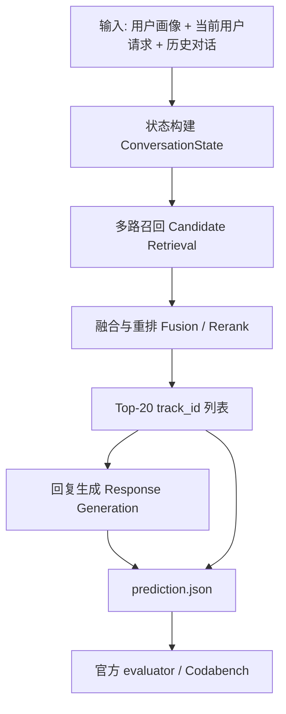
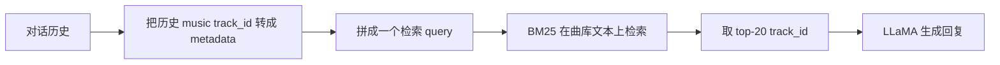
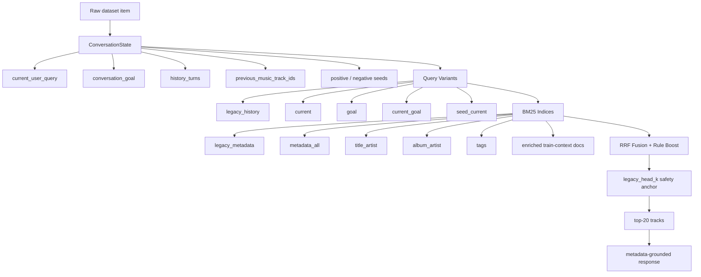

# GoalFlow-MusicCRS 系统设计与阶段日志

本文是给第一次参加推荐系统比赛的同学看的阶段汇报。目标不是炫术语，而是把“这个比赛要做什么、baseline 怎么跑、我们现在做到了哪一步、每一步为什么做、效果好坏、踩过什么坑、后面怎么走”讲清楚。

当前项目目录：

```text
/Users/bytedance/generated_problems/recsys2026_music_crs/goalflow_musiccrs
```

当前安全提交包：

```text
experiments/goalflow_safe_bm25_response_shifted_feedback/blindset_A/submission.zip
```

## 1. 比赛任务一句话

RecSys Challenge 2026 Music-CRS 是一个“对话式音乐推荐”比赛。

系统每次看到：

- 用户画像，例如国家、语言、音乐文化偏好；
- 当前用户说的话；
- 前面几轮对话；
- 前面系统推荐过哪些歌；
- 可能还有隐藏在对话里的偏好，例如 mood、genre、artist、年代、封面线索、歌词主题。

系统要输出：

- `predicted_track_ids`：从官方曲库里选 20 首歌，按从最可能正确到最不可能正确排序；
- `predicted_response`：给用户的一段自然语言回复，解释为什么推荐这些歌。

最终提交是一个 JSON 文件，里面每个 session-turn 一条预测。

```json
{
  "session_id": "...",
  "user_id": "...",
  "turn_number": 3,
  "predicted_track_ids": ["track_id_1", "... 共 20 个 ..."],
  "predicted_response": "I leaned into ..."
}
```

## 2. 关键评测指标

### nDCG@20

`nDCG@20` 是主推荐指标。可以把它理解成：

如果正确歌曲排第 1，得分最高；排第 2，得分低一点；排得越靠后，得分越低；如果没进前 20，得 0。

这个比赛每轮只有一个官方 gold track，所以排序头部非常重要。

### Catalog Diversity

`Catalog Diversity` 是全局推荐覆盖度。大意是：你的系统是不是总推荐同一小撮热门歌，还是能覆盖更多曲库。

它重要，但不能为了多样性牺牲 top-1/top-5，因为 nDCG 是主指标。

### Distinct-2

`Distinct-2` 是文本回复的词汇多样性指标。它看回复里二元词组有多少不同。所有回复都写成 “Here are some songs you might enjoy” 会很差。

### LLM-as-a-Judge

Blind set 上还会用 Gemini 之类的大模型评价回复质量，主要看：

- personalization：有没有根据用户和对话个性化；
- explanation quality：解释是否具体、可信、不空泛。

## 3. 总流程图

下面这张图是整个系统的第一视角。



图怎么读：

- `状态构建` 是把一堆对话文本整理成当前推荐要用的信息；
- `多路召回` 是先从 47071 首歌里捞出一批可能候选；
- `融合与重排` 是把候选按可信度排序；
- `回复生成` 是在已经定好 top-20 后，再写给用户看的解释文本。

## 4. 官方 baseline 是什么

baseline 可以理解成官方给的“能跑通的起点”。

它大概做了这些事：



### BM25 是什么

BM25 是一种传统文本检索算法。你可以把它理解成搜索引擎里的“关键词匹配增强版”。

如果用户说：

```text
I want a Green Day style punk rock track from the 2000s.
```

BM25 会更偏向包含 `Green Day`、`punk rock`、`2000s` 这些词的歌曲文档。

优点：

- 快；
- 稳；
- 不需要 GPU；
- exact title / artist 线索很强时好用。

缺点：

- 不太懂隐含语义；
- 用户说 “dreamy, soft, late-night feeling” 时，未必能匹配到真正对味的歌曲；
- 对 audio、cover art、user preference 无感。

### baseline 的强点

官方 BM25-history baseline 在 dev 上很稳，我们复制出的强 baseline 大约是：

```text
nDCG@20 = 0.08587
Catalog Diversity = 0.38897
Lexical Diversity = 0.000125
```

也就是说：推荐排序还可以，但回复非常模板化。

### baseline 的弱点

它基本是：

```text
历史对话文本 -> BM25 -> top20
```

它没有充分利用：

- `conversation_goal`；
- `goal_progress_assessments`；
- 多个检索索引；
- 官方 embeddings；
- train conversation 里“用户怎么描述某首歌”的信息；
- learning-to-rank 模型；
- 多样化但不伤 top-rank 的后处理；
- 更个性化的回复生成。

## 5. 我们的系统 GoalFlow-MusicCRS

项目名：

```text
GoalFlow-MusicCRS
```

一句话：

先把对话解析成当前音乐搜索状态，再用多路召回找候选，最后通过诊断、融合、未来 LTR 模型把候选排好，并生成更像真人的解释。



## 6. 当前代码模块

核心代码在 `goalflow/`：

```text
goalflow/
  data.py              数据集常量、TrackCatalog
  state.py             ConversationState 构建
  documents.py         曲目文档 + train-context augmentation
  bm25_retrieval.py    多 BM25 index
  fusion.py            RRF、rule boost、多样性后处理
  response.py          回复生成
  pipeline.py          dev/blind 主流程
  validation.py        prediction.json 校验
  embeddings.py        官方 embedding store 骨架
```

脚本在 `scripts/`：

```text
scripts/
  run_goalflow.py                 跑 dev / blind
  evaluate_official.py            调官方 evaluator
  validate_predictions.py         校验 submission 格式
  diagnose_retrieval_sources.py   诊断每个 source 的 hit/nDCG
  export_ltr_dataset.py           导出 LTR 训练 JSONL
  audit_progress_labels.py        审计 progress label 语义
  inspect_embeddings.py           检查官方 embedding schema
  merge_legacy_head.py            合并 legacy head 的辅助脚本
```

研究记录在：

```text
research/
  DEEP_RESEARCH_BACKLOG.md
  pro_answers/
```

## 7. 我们一步一步做了什么

### Step 1：复制出独立项目，不覆盖官方 baseline

用户要求“如果需要 baseline 要复制一份，不要直接覆盖”。

所以我没有在 `music-crs-baselines` 里乱改，而是创建了：

```text
goalflow_musiccrs/
```

这样官方 baseline 仍然保持干净，出问题也能回退。

效果：

- 好：代码结构更清楚；
- 好：后续实验不会污染官方仓库；
- 好：能同时保留 official baseline 和 GoalFlow 实验。

### Step 2：跑通 safe baseline

目标不是一上来冲榜，而是先保证完整流程能跑：

```text
load data -> retrieve -> generate prediction.json -> validate -> zip
```

当前安全设置：

```text
legacy_head_k = 20
```

意思是 top-20 推荐 ID 先完全保护强 BM25 baseline 排序，GoalFlow 先只改善 response。

结果：

```text
nDCG@20 = 0.08587
Lexical Diversity 从 0.000125 提升到 0.082975
```

解释：

- 推荐主指标不下降；
- 回复文本明显不再是常量模板。

### Step 3：构建多路 BM25 index

我把曲库文档拆成多个 index：

```text
legacy_metadata = track_name + artist_name + album_name + release_date
metadata_all    = track + artist + album + tags + release_date + popularity
title_artist    = track_name + artist_name
album_artist    = album_name + artist_name + release_date
tags            = tag_list
enriched        = metadata + train conversation snippets
```

为什么要拆？

因为不同问题需要不同“搜索视角”：

- 找具体歌名：`title_artist` 重要；
- 找专辑：`album_artist` 重要；
- 找 mood / genre：`tags` 和 `metadata_all` 重要；
- 用户自然语言描述：`enriched` 可能更有用。

### Step 4：构建 query variants

同一轮对话，我们不只搜当前用户一句话，还构造多个 query：

```text
legacy_history
current
goal
current_goal
seed_current
quoted_entities
```

例子：

用户当前说：

```text
I want something like the last one but more energetic.
```

如果只搜当前句子，信息很少。

`seed_current` 会加入上一首推荐歌的 metadata，这样系统知道 “last one” 是什么。

### Step 5：Train-context document augmentation

这是一个重要想法。

普通曲目文档只有：

```text
track_name
artist_name
album_name
tag_list
```

但训练集告诉我们：什么样的用户请求曾经导致某首歌成为 gold track。

所以我给每首歌追加训练集中对应的上下文片段：

```text
training_user_query
training_goal
music_selection_reason
assistant_explanation
```

这叫 `track document augmentation`。

小白理解：

原来每首歌像一张身份证，只写“姓名/歌手/标签”。

现在我们给它加“别人曾经怎么描述它、为什么选它”的简历。

注意泄漏边界：

- dev 评估时只能用 train augmentation；
- 不能把 dev gold 反向塞进文档再评估 dev；
- train+dev augmentation 只能作为最终 blind 前的公开标签 retrain，并且要明确标注。

### Step 6：RRF fusion

RRF 全名 Reciprocal Rank Fusion。

它是把多个检索器的排名合并起来的一种方法。

公式直觉：

```text
一个候选在某个 source 排第 1，得分高；
排第 100，得分低；
多个 source 都支持它，总分会叠加。
```

我们最开始以为：多路召回 + RRF 应该比单路 BM25 更强。

实际结果：

| Run | nDCG@20 | 说明 |
|---|---:|---|
| `bm25_static_devset` | 0.08587 | 强 BM25-history baseline |
| `goalflow_bm25_aug_v1` | 0.06787 | 裸多源 RRF，变差 |
| `goalflow_bm25_aug_v2` | 0.07450 | 加 legacy 权重，仍差 |
| `goalflow_bm25_aug_v3_head10` | 0.08378 | 保护 top10，接近 baseline |
| `goalflow_bm25_aug_v3_head20` | 0.08587 | 完全保护 top20，安全 |

发现：

多源不是没用，而是“融合方式不会判断哪个 source 可信”。

### Step 7：RRF source diagnostics

为了不靠猜，我写了：

```text
scripts/diagnose_retrieval_sources.py
```

它会统计：

- 每个 source 单独能不能找到 gold；
- gold 在每个 source 排第几；
- RRF 融合后 gold 排第几；
- 按 intent / turn / category 分组表现如何；
- legacy vs fused 到底 gained/lost/demoted 了多少。

关键结果：

```text
best_single_source hit@20 = 0.4715
best_single_source nDCG@20 = 0.2600

current RRF hit@20 = 0.2595
current RRF nDCG@20 = 0.1015
```

这说明：

```text
候选源其实能找到 gold；
但 RRF 没把正确 source 的正确候选排上去。
```

legacy-vs-fused delta：

```text
gained = 446
lost = 212
demoted = 642
promoted = 723
mean_dcg_delta@20 = +0.0158
```

解释：

- `gained`：legacy top20 没中，RRF top20 中了；
- `lost`：legacy top20 中了，RRF 搞丢了；
- `demoted`：都中了，但 RRF 把 gold 排得更靠后；
- `promoted`：都中了，RRF 把 gold 排得更靠前。

结论：

RRF 有净收益，但会伤很多原本好的头部排序。下一步要做 `source gating` 或 `LambdaRank`。

### Step 8：Progress label 语义审计

字段：

```text
goal_progress_assessments
```

一开始我保守假设：

```text
turn t 的 label 评价 turn t 的 music
```

后来写了审计脚本：

```text
scripts/audit_progress_labels.py
```

发现：

```text
turn 1 label 全部缺失
turn 2-8 才有 MOVES / DOES_NOT_MOVE
```

样本里也显示：用户在 turn 2 的话是在评价 turn 1 推荐。

所以正确理解更可能是：

```text
progress[t] 是用户在 turn t 对上一轮 music[t-1] 的反馈。
```

我已经把代码改成：

```python
history music turn m -> progress[m + 1]
```

这避免了错误使用反馈信号。

### Step 9：LTR feature export

LTR 是 Learning To Rank，中文可以叫“学习排序”。

普通规则排序是我们手写：

```text
score = RRF + boost
```

LTR 是让模型学习：

```text
在什么情况下哪个 source 更可信；
什么特征意味着这首歌应该排更前；
什么特征只是噪声。
```

我写了：

```text
scripts/export_ltr_dataset.py
```

它导出 JSONL：

```json
{
  "group_id": 0,
  "session_id": "...",
  "turn_number": 1,
  "track_id": "...",
  "label": 0,
  "features": {
    "rrf_score": 1.01,
    "rule_boost": 2.31,
    "source_count": 25,
    "best_source_rank": 1,
    "intent": "specific_track"
  }
}
```

一个 `group_id` 就是一轮推荐任务。

模型目标：

```text
把 label=1 的 gold track 排到同组候选最前面。
```

### Step 10：官方 embedding store

Embedding 是“向量表示”。

小白理解：

每首歌除了文本名片，还可以被表示成一串数字。相似的歌，在数字空间里距离近。

官方提供了：

```text
audio-laion_clap                  512 维
image-siglip2                     768 维
cf-bpr                            128 维
attributes-qwen3_embedding_0.6b   1024 维
lyrics-qwen3_embedding_0.6b       1024 维
metadata-qwen3_embedding_0.6b     1024 维
```

我踩了一个坑：

baseline tips 里写的是旧数据：

```text
talkpl-ai/TalkPlayData-2-Track-Embeddings
```

它和 Challenge 当前曲库的 `track_id` 是 0 overlap。

正确数据是：

```text
talkpl-ai/TalkPlayData-Challenge-Track-Embeddings
talkpl-ai/TalkPlayData-Challenge-User-Embeddings
```

我写了：

```text
goalflow/embeddings.py
scripts/inspect_embeddings.py
```

当前只是 store 骨架，还没接入主预测链路。

## 8. 为什么现在不直接让 embeddings 改 top20

因为我们已经看到一个规律：

```text
新增 source 可能提高候选覆盖，
但如果融合没有校准，会伤 nDCG。
```

所以官方 embeddings 下一步要先作为：

- candidate source；
- LTR feature；
- seed similarity signal；
- user-CF personalization signal。

不要一上来直接覆盖 top-20。

## 9. 当前已知坑与解决

### 坑 1：Chrome 自动化第一次发成语音

现象：

ChatGPT 页面按钮在无文本时是“启动语音功能”，有文本后才变成“发送提示”。

第一次我没判准状态，内容进了输入框但没真正提交，甚至进入语音相关状态。

解决：

后续提交前检查：

```text
button aria-label == 发送提示
voice=false
提交后出现 Pro 思考中
```

### 坑 2：heartbeat 没按 10 分钟唤醒

我创建了 thread heartbeat，但它没有在预期时间恢复执行。

解决：

已删除该自动化。以后等待网页 Pro 时，不依赖 heartbeat，手动检查和保存。

### 坑 3：裸 RRF 变差

现象：

多源召回看起来更丰富，但 nDCG 下降。

原因：

多个低精度 source 会一起投票，把 legacy top hit 挤下去。

解决：

加入：

- `legacy_head_k` 安全保护；
- source diagnostics；
- legacy-vs-fused delta；
- 下一步做 source gating / LTR。

### 坑 4：Progress label 错位

现象：

turn 1 没 label。

原因：

label 更可能是下一轮用户对上一轮推荐的反馈。

解决：

把历史 music turn `m` 的反馈改成 `progress[m + 1]`。

### 坑 5：Embedding 数据集名容易用错

现象：

`TalkPlayData-2-Track-Embeddings` 和当前 catalog 0 overlap。

解决：

使用 `TalkPlayData-Challenge-Track-Embeddings`。

## 10. 当前指标汇总

| 项目 | 结果 | 解释 |
|---|---:|---|
| BM25 static nDCG@20 | 0.08587 | 当前安全推荐主指标锚点 |
| GoalFlow v1 nDCG@20 | 0.06787 | 裸 RRF 伤排序 |
| GoalFlow v2 nDCG@20 | 0.07450 | 加权后仍不够 |
| head10 nDCG@20 | 0.08378 | 接近 baseline |
| head20 nDCG@20 | 0.08587 | 完全保住 baseline |
| head20 lexical diversity | 0.08298 | 回复文本明显改善 |
| best-source hit@20 | 0.4715 | 说明召回源有潜力 |
| RRF hit@20 | 0.2595 | 融合还不够会选 |
| RRF gained/lost | 446 / 212 | 有净收益 |
| RRF demoted | 642 | 头部排序伤害很明显 |

## 11. 当前安全提交策略

当前最安全 Blind A 包：

```text
experiments/goalflow_safe_bm25_response_shifted_feedback/blindset_A/submission.zip
```

特点：

- 推荐 ID 仍由强 BM25 baseline top20 锚定；
- 修正了 progress label shifted feedback；
- response 更丰富；
- 校验通过。

为什么安全：

我们还没有证明多源融合能稳定超过 baseline，所以不冒险替换 top20。

## 12. 下一步路线

### 12.1 Source gating

目标：

不再让所有 source 自由投票。

思路：

```text
specific_track: title_artist / legacy 权重大
mood_playlist: attributes / tags / user_cf 权重大
cover_art: image source 权重大
lyrics_theme: lyrics source 权重大
```

输出：

- 一个 controlled fusion 版本；
- 对比 gained/lost/demoted；
- 如果 nDCG 稳定，再替换 safe baseline。

### 12.2 Embedding seed/user-CF

先做最稳的几个：

```text
seed_metadata
seed_attributes
seed_cf
user_cf
```

暂时不急着做：

```text
lyrics direct query
audio direct query
image direct query
```

原因：

官方给的是 track embedding，不一定给 query encoder。seed similarity 和 user-CF 更安全。

### 12.3 LightGBM LambdaRank

训练目标：

```text
group = session_id + turn_number
positive = gold track
negative = 候选里其他 track
```

第一版特征：

- source ranks；
- RRF score；
- rule boost；
- intent/category/specificity；
- popularity/release_year；
- seed same artist / same album；
- future embedding features。

### 12.4 Response subsystem

目标：

- 提升 Distinct-2；
- 提升 Gemini judge；
- 不编造 metadata；
- 根据用户画像、goal、反馈解释推荐。

策略：

- 多模板族；
- 先固定 top20，再生成 response；
- 自检是否 hallucination；
- 按 intent 使用不同语气和解释点。

## 13. 给绘图工具的图像说明

如果后面用 ChatGPT 网页画图或让设计工具画图，可以让它画这几张。

### 图 1：比赛输入输出图

画面左侧是输入：

- user profile；
- current user request；
- conversation history；
- official track catalog。

中间是一个盒子：

- Music-CRS System。

右侧是输出：

- ranked top-20 track IDs；
- natural language response。

### 图 2：Baseline vs GoalFlow

分成上下两条流水线。

上面 baseline：

```text
history -> BM25 -> top20 -> LLaMA response
```

下面 GoalFlow：

```text
state -> multi-query -> multi-index BM25 -> RRF diagnostics -> safe head / future LTR -> response templates
```

用不同颜色标出“新增模块”。

### 图 3：RRF 问题图

左侧画一个 legacy source，gold track 排第 3。

右侧画多个 auxiliary source，它们各自把一些错误候选排在前面。

中间 RRF 投票后，错误候选因为多个 source 支持而超过 gold。

图上标：

```text
source-vote flooding
```

### 图 4：Progress label shift

画时间线：

```text
turn 1 user -> music_1 -> assistant_1 -> turn 2 user feedback -> g_2
```

标注：

```text
g_2 evaluates music_1, not music_2
```

### 图 5：未来 LTR 架构

画：

```text
candidate union -> feature table -> LightGBM LambdaRank -> reranked top20
```

feature table 里列：

- source ranks；
- seed similarity；
- user-CF；
- metadata priors；
- intent features。

## 14. 小白术语表

| 术语 | 中文解释 |
|---|---|
| CRS | Conversational Recommender System，对话式推荐系统 |
| track_id | 每首歌在官方曲库里的唯一 ID |
| catalog | 官方曲库 |
| candidate | 候选歌曲 |
| retrieval | 召回，从全曲库先捞一批可能相关的歌 |
| ranking / reranking | 排序 / 重排序 |
| BM25 | 传统关键词检索算法 |
| embedding | 向量表示，把文本/歌曲/用户变成数字向量 |
| CF | Collaborative Filtering，协同过滤，根据相似用户/共听行为推荐 |
| BPR | Bayesian Personalized Ranking，一种推荐排序训练方法 |
| RRF | Reciprocal Rank Fusion，多路排序融合方法 |
| LTR | Learning To Rank，学习排序 |
| LambdaRank | 一类直接优化排序质量的模型训练方法 |
| LightGBM | 一个常用的梯度提升树模型库 |
| seed track | 历史推荐里可作为口味参考的歌曲 |
| positive seed | 用户反馈较好的历史歌曲 |
| negative seed | 用户反馈不好的历史歌曲 |
| leakage | 泄漏，把评测答案或未来信息偷偷放进训练/检索里 |
| nDCG | 排序指标，正确答案越靠前越高 |
| Distinct-2 | 文本多样性指标，二元词组越丰富越高 |
| LLM-as-a-Judge | 用大模型当裁判评价文本质量 |

## 15. 当前状态总结

现在这个项目已经不是“只跑通 baseline”的状态，而是一个可继续迭代的实验框架：

- baseline 能跑；
- blind submission 能生成；
- response 已经比 baseline 多样；
- 多源召回已经实现；
- RRF 失败原因已经被量化；
- progress label 语义已修正；
- LTR 数据导出已准备；
- official embeddings schema 已确认；
- deep research 问题已分批送到 Pro 模型；
- 下一步可以从 source gating、embedding seed/user-CF、LightGBM 三条线继续推进。

最重要的判断：

```text
不要为了看起来高级而立刻替换 baseline top20。
先让新增模块证明它能稳定提高 nDCG，再动最终提交的排序头部。
```

## 16. 5 月 25 日晚新增工作：从“能排准”转向“少重复、会解释”

你提交过一次保守版本后，公共 Blind A 返回了非常关键的信号：

| 指标 | 公共 Blind A 分数 |
|---|---:|
| nDCG@20 | 0.1935 |
| Catalog Diversity | 0.0257 |
| Lexical Diversity | 0.0125 |
| LLM Judge | 1.0000 |
| Composite | 0.1006 |

这组数的直观含义是：

- 推荐排序不是最差的地方，甚至比本地 dev 指标看起来更有希望。
- 系统太爱重复同一批歌，导致 catalog diversity 很低。
- 回复文本太模板化，导致 lexical diversity 和 LLM judge 都很弱。

所以这一轮我没有继续盲目加更多召回源，而是做了两个更低风险的改动。

### 16.1 Source-Gated Fusion

新增参数：

```bash
--fusion-mode gated
```

它的想法是：

```text
legacy/BM25 头部先保护住
其他来源的候选只有证据足够强才允许进 top20
```

本地 dev 结果：

| Run | nDCG@20 | Catalog Diversity | 结论 |
|---|---:|---:|---|
| `goalflow_gated_head5` | 0.0787 | 0.4712 | 多样性提高，但排名还不够稳 |

结论：这个方向值得继续研究，但当前手写 gate 还不能替代保守 baseline。

### 16.2 Tail Diversity

新增参数：

```bash
--tail-diversity-start 15
--global-repeat-penalty 0.06
```

这版只动第 16 到第 20 首，前 15 首仍然保护原有强排序。它做三件事：

- 对全局已经推荐很多次的 track 降权；
- 控制同 artist / album 在尾部过度堆叠；
- 优先把没出现过或少出现过的候选放进尾部。

本地 dev 结果：

| Run | nDCG@20 | Catalog Diversity | Lexical Diversity | 结论 |
|---|---:|---:|---:|---|
| `goalflow_taildiv_head10` | 0.0721 | 0.8323 | 0.1019 | 太激进，排名掉太多 |
| `goalflow_taildiv_head15` | 0.0818 | 0.7676 | 0.1019 | 当前最稳的多样性候选 |

当前可提交候选包：

```text
experiments/goalflow_taildiv_head15/blindset_A/submission.zip
```

这个包不是替代安全包的绝对答案，而是一个“用最后 5 个位置换多样性”的线上实验版本。

### 16.3 Response 多样化

原先回复虽然不是完全常量，但句式仍然太少。这一轮改成了按 session/turn 稳定分流的多模板回复：

```text
同样的输入每次生成同一种回复，保证可复现；
不同 session 会走不同句式，提升 Distinct-2；
每句话仍然绑定 track、artist、album、tags、profile 或 feedback，减少胡编。
```

这把 dev lexical diversity 从约 `0.0830` 提高到 `0.1019`。

### 16.4 新一批 Pro 问题

我又把 5 个研究问题发给网页端 Pro：

- 公共 Blind A 后处理策略；
- metadata-grounded response generation；
- catalog diversity 的 batch-level 策略；
- dev / blind 分数错位诊断；
- 下一步最高 ROI：LTR、embedding、CF、cross-encoder 还是 response。

已保存的完整回答：

```text
research/pro_answers/round3/tab1_blind_postprocessing_strategy.txt
research/pro_answers/round3/tab5_metadata_grounded_response_design.txt
```
